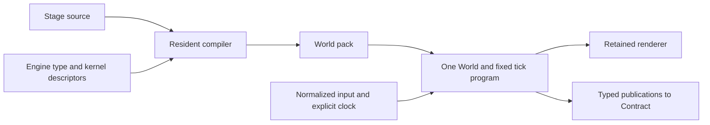

# LLP 1041.008: Stage — scene authoring as a compiled world program

**Type:** RFC
**Status:** Draft
**Systems:** Game scene authoring, simulation, compiler, world storage, rendering, development reload
**Author:** Codex, independently for Charlie Cheever
**Date:** 2026-09-18
**Revised:** 2026-09-18
**Related:** [LLP 1041](1041-agent-native-game-engine.research.md), [1041.000](1041.000-lanterns-test-game.rfc.md), [1041.006](1041.006-game-development-experience.rfc.md), [1005](1005-plan-and-runner-v1.spec.md), [1006](1006-contract-compiler-v1.spec.md)

**Authorization:** Charlie requested an independent language proposal on 2026-09-18, including reconsideration of the engine. This RFC proposes a direction; it does not accept it, assign implementation, or amend the scope rules. Implementation owner and start date are unassigned. Claude's parallel language proposal was not read; existing engine and development-experience work was.

## 1. Recommendation

Build **Stage**, a small typed language whose program describes **a world, its state, and the work that advances it**. `.stage` is the provisional source extension; the existing `.world` extension remains a saved world. Contract continues to describe the game's UI.

The useful inheritance from Contract is that the compiler knows the whole authored program and emits a compact executable plan. The useful departure is that a game world persists and evolves independently of its declaration. It is not reconstructed from a component tree each tick. A lantern remains lit after the function that lit it returns; a fired projectile outlives the input event; a physics body owns its current position.

Three choices make the proposal:

1. **Distinguish authored values, saved state, and calculated values in the source.** This tells both the optimizer and the development reload what they may replace.
2. **Write behavior near the things it describes, execute it over batches.** Prefabs are an authoring abstraction. Their expansion produces typed data and a small ordered program, not an object with an `update()` callback per instance.
3. **Keep ordinary game edits out of Cargo.** Scene placement, parameters, state declarations and bounded gameplay steps compile to data and typed batch bytecode. Rust implements the engine's substantial algorithms through explicit typed calls.

The runtime-speed thesis is primarily **doing less work because the language can establish what changes**. Being declarative does not itself make code faster than Rust. A prettier scene file that merely invokes the same constructors would be an ergonomics improvement, but would not satisfy both goals of this proposal.

## 2. Starting point and constraints

The code inspected on 2026-09-18 is ahead of the main checkout in sibling worktrees:

| Baseline | What exists and what it means here |
|---|---|
| `exact2-wt-game-dx`, HEAD `76ca47fe`, plus its working tree | `game/engine/src/{world,storage,sim}.rs`: one typed World, fixed ticks, ordered queries, saved state, dynamic storage leases. `game/render/src/world.rs`: retained batches, page generations and filtered uploads; frames already avoid walking entity storage. |
| `exact2-wt-game-dx-scene`, HEAD `c32ee683`, plus staged scene work | `game/scene/`: typed JSON, named fragments, Rust-derived validation, baked binary content and source maps. Content edits can reuse a native baker without compiling behavior. Continue retains old construction data. |
| Lanterns in those checkouts | Rust setup and tick behavior, Rapier, animation, audio, Contract screens, one optional game module. The scene lane moves the authored placements into JSON. |
| [LLP 1005](1005-plan-and-runner-v1.spec.md#2-bytes-planencode--plandecode), [1006](1006-contract-compiler-v1.spec.md#3-passes) | Contract already separates compiler from runtime and validates a plan before execution. Its boxed value VM and tree regions are not the proposed numerical game executor. |

These are source observations, not new performance measurements or a claim that all lanes have landed. The scene baseline's 11 authoring tests passed during this investigation (`EXACT_UPDATE_TRUST=development cargo test --manifest-path game/Cargo.toml -p exact-game-scene --no-fail-fast`, in the scene checkout). That validates the existing scene implementation, not Stage's hypothetical syntax or executor. The scene work already solves content-only rebuilds; Stage must earn its additional compiler and runtime through behavior iteration and execution savings.

The governing boundaries remain [RULES](../rules/RULES.md#scope), [DEFERRED](../rules/DEFERRED.md), [LLP 1041 §5](1041-agent-native-game-engine.research.md), [1041.006 §3](1041.006-game-development-experience.rfc.md#3-shared-constraints-and-proposed-scope-trade), and [1012](1012-agent-api-v1.spec.md): an optional game workspace/artifact, one world, explicit time and randomness, the existing eight agent operations, no game compiler on the device, and no additions to the five blocking checks. The web is the development loop; native is swept. CSS remains the authority for UI; metres and simulation ticks describe a different domain and never become CSS layout properties.

The covering document is 1041.006 §7. This independently requested alternative deliberately goes beyond its JSON-plus-Rust cut: **Stage authors bounded behavior as well as initial conditions**. It is a child of the game investigation, not an amendment to Contract's grammar or a second accepted implementation spec.

## 3. What authoring should feel like

The following is proposed syntax, not code accepted by an existing compiler. It is a Lanterns excerpt; the imported kits encapsulate character movement, rigid bodies and camera following, and the other ten lantern placements are omitted.

```text
import { Player, Crate, Ground, CameraRig, chime } from "./kits.stage"
import { move_player, physics_step, follow_camera } from engine

asset fox = model("assets/Fox.glb")

prefab Lantern(at: vec3<m>, tint: color = #ffd68a):
    const Transform.position = at
    const Mesh = cylinder(radius: 0.18m, height: 1.3m)
    const Material.color = tint
    state lit: bool = false
    state lit_at: tick = 0tick

    present PointLight.intensity = lit
        ? 4.0 * ease_out(seconds_since(lit_at), duration: 180ms)
        : 0.0
    present Material.emissive = tint * PointLight.intensity

enum Phase { playing, won, lost }

scene Lanterns(seed: u64):
    input move: vec2
    input jump: pulse
    input light: pulse
    state phase: Phase = playing
    state elapsed: ticks = 0tick

    entity ground = Ground(size: [36m, 1m, 36m])
    entity player = Player(at: [0m, 0.65m, 12m], model: fox)
    entity crate = Crate(at: [6m, 0.6m, 8m], mass: 3kg)
    entity camera = CameraRig(target: player, offset: [0m, 9m, 13m])
    entity quay = Lantern(at: [-12m, 0m, 10m])
    entity ledge = Lantern(at: [10m, 2.4m, 8m])

    step advance_time:
        elapsed += 1tick

    step light_nearest:
        if pressed(light):
            if let target = nearest<Lantern>(
                to: player.Transform.position,
                within: 1.5m,
                where: not it.lit
            ):
                target.lit = true
                target.lit_at = tick
                emit sound(chime, at: target.Transform.position)

    step finish:
        if count(Lantern where it.lit) == count(Lantern):
            phase = won
        else if elapsed >= ticks(180s):
            phase = lost

    tick 60Hz:
        when phase == playing:
            move_player(player, move, pressed(jump))
            physics_step()
            advance_time()
            light_nearest()
            finish()
            follow_camera(camera, player)

    publish lit = count(Lantern where it.lit)
    publish total = count(Lantern)
    publish remaining = max(0s, 180s - seconds(elapsed))
    publish phase = phase
```

`scene` defines construction arguments; `input` defines the normalized values arriving at a tick boundary. Existing action maps bind keyboard, touch and Contract button counters to those inputs. A pulse carries an edge count; `pressed` tests whether it is nonzero and does not consume a hidden cursor. Pause uses the existing simulation pause boundary. There is no browser or platform input call inside this source.

`Player` declares its transform as state; `Crate` gives physics write access to state. `Lantern` declares its position constant. The compiler can consequently reject a physics attachment that would try to move that lantern. The author can change its declaration to state deliberately.

Lighting only the nearest unlit lantern is written once. There is no handler on every lantern that independently notices the same button and lights all nearby lanterns. Equidistant candidates use a specified entity-order tie-break. The finish step explicitly gives winning precedence over timeout on the last tick. These are gameplay semantics the language should expose clearly.

This excerpt illustrates the proposed language, not a byte-equivalent port: it simplifies geometry, uses an ease in place of the current spring and chooses explicit tie/timeout rules. The current Rust nearest loop replaces its candidate on equal distance, and its timeout runs after interaction. A conversion must intentionally preserve or revise those rules in both compared implementations; different rules or cheaper animation cannot be counted as an optimization win.

Ordinary behavior needs neither a custom Rust component nor another script runtime:

```text
prefab Bullet(at: vec3<m>, velocity: vec3<m/s>):
    state Transform.position = at
    const velocity = velocity
    const lifetime = 2s
    state age = 0s
    const Mesh = sphere(radius: 0.03m)

step fly:
    each b in Bullet:
        b.Transform.position += b.velocity * dt
        b.age += dt
        if b.age >= b.lifetime:
            despawn b
```

`fly()` is called once from a scene's tick program. Its instances become one typed query and batch body. This example deliberately has no collision; a swept-collision kernel must be called explicitly to add it. Concise syntax must not imply an unimplemented gameplay service.

### 3.1 Composition without a mandatory tree

A prefab is a named, typed composition of components, state and optionally named child entities. Parameters and imports replace inheritance. Nested prefab instances qualify local keys; references resolve in two passes, so forward references work. Repeated placements require explicit stable keys; file order, array offsets and source line numbers are not identities. A top-level identifier is its default authored key; an explicit `key "..."` keeps identity across a rename.

**Ownership, transform parenting and references are separate relationships.** A lantern owns its bulb for lifetime purposes; a fox mesh inherits its player's transform; a camera references its target without becoming its child. Nesting establishes lexical ownership only. `parent = player` establishes the transform relationship explicitly. Deleting an owner deletes its owned entities at a structural boundary; changing a transform parent does not change ownership. Both forests reject cycles. Dynamic rigid bodies are world-space roots in the first version; scaled or moving physics parents are refused until their semantics are implemented.

Composition forwards parameters and permits an explicit field assignment at the instance site. A field override replaces that field, exactly once; there is no recursive merge, wildcard selector, inherited override stack or runtime CSS cascade. Private prefab state is not an override surface. Shared asset handles are immutable; per-instance appearance is a field, not a mutation of the shared asset.

Runtime `spawn Bullet(...) key ("shot", shot_sequence)` uses a saved, checked monotonic counter for identity and commits at the next structural boundary. The new entity is scene-owned unless an owner is explicit; firing it does not accidentally make its lifetime depend on the shooter's. Authored required references are checked at bake. References stored in state are generational handles; resolving one after its target can be destroyed returns an option, never a reference into recycled storage.

Use the engine's metres, right-handed Y-up coordinates and negative-Z forward convention. Literal suffixes and contextual numeric types catch metres/seconds and degrees/radians mistakes. Units erase after checking. Start with the dimensions the engine uses, not an extensible symbolic-algebra language. Engine component names, enum cases and defaults come from the engine declarations; Stage does not invent another spelling of `Transform` or `Body`.

## 4. The central distinction: who owns a value?

| Declaration | Meaning | Saved? | A compatible development edit |
|---|---|---|---|
| `const` | Authored value, fixed during a running program generation; may depend on construction parameters | Definition bound by the pack digest; preserve the matching definition for a checkpoint | Replace at the declared boundary; invalidate consumers |
| `state` | Initial value plus mutable simulation state | Yes, including timers, spawn counters and random-stream positions | Keep the current value; a changed initializer affects new instances or Restart |
| `derive` | Pure function of current simulation data; no independent writer | Reconstructible; never treated as independent state | Recompute from the retained state |
| `present` | Pure output for rendering from simulation data and presentation time | Output is disposable; any needed event time/history is explicit state | Recompute; simulation cannot read it |

Unqualified engine fields take their declared defaults and are authored constants. Any engine operation that writes a field requires that field to be state. `state Transform = ...` may mark a whole component when that is the natural ownership boundary. The compiler reports inferred defaults and the owner of a conflicting field. Lifetime is never guessed from whether a value happened to change during a run.

An ordinary scalar expression is pure. There is no ambient time, `random()`, host I/O, allocation of arbitrary objects, reflection, `eval`, recursion, unbounded loop or dynamically discovered function. There are typed records/enums/options, scalar and vector arithmetic, conditionals, finite queries, keyed construction, bounded event output and named calls. Engine descriptors determine scalar widths; Stage's unconstrained real defaults to f32. Integer overflow and nonfinite simulation results fault rather than wrap or propagate silently. Literal folding uses the runtime's widths and operation order. No implicit fast-math, fused floating-point contraction or approximate SIMD transcendental substitutes are allowed; the existing deterministic math remains the simulation vocabulary. Strings and asset paths are interned outside tick execution; a numerical inner loop does not manufacture strings.

`derive` is a formula, not a subscription. Reading it has the semantics of evaluating the formula against the state visible at that program point. The compiler can inline it or materialize it and insert invalidation in the fixed program. A dependency cycle is an error. Feedback goes through explicit state and ordered steps. There is no heap object or callback list for each binding.

`present` cannot drive a collider, a hit test or a subsequent simulation step. Cosmetic interpolation and light fades use the simulation's presentation time, including its pause/seek policy, never wall time. In the example `lit_at` preserves the fade's origin through a reload; the calculated light intensity is not saved. A moving platform that carries the player must move in a simulation step. A visual bob on its mesh can be presentation-only.

State machines need no second DSL initially: an enum state, a saved entry tick, and `match`/`if` in a step suffice. Springs use the existing saved spring kernel. A pure ease from a recorded event time needs no evolving spring state. Introducing `await`, coroutine stacks, animation graphs or a behavior-tree VM before these forms prove inadequate would multiply reload and debugging semantics.

## 5. Tick semantics that make optimization possible

**The tick program is ordered source, not a runtime scheduler.** The scene author chooses the order of substantial operations, as today's Rust tick does. The compiler derives read/write effects and checks them; authors do not maintain an independent effects manifest.

1. Freeze normalized input for tick N. Advance the integer simulation tick through the existing driver; a large agent seek executes each required tick. `dt` is the declared rate's typed floating-point interval, not a claim that floating-point `1/60` is exact. Duration deadlines convert to the first tick at or after their duration.
2. Execute the listed calls in order. Within a scalar step or one row body, assignments have ordinary sequential meaning. The next call sees completed writes. Guards are evaluated when reached; the `when` guard in the example is evaluated once for that block.
3. An `each` query fixes its membership at call entry. Its body can mutate that row and its owned fields. Cross-row reads of fields written by the same body are refused; invariant reads are allowed. Arbitrary cross-row writes require an explicitly ordered scalar step or a reduction/event boundary. This is the independence the compiler needs to batch lanes without changing meaning.
4. Spawn, despawn and component-membership changes are queued and committed at the end of the call. New entities first participate in the next call; an entity scheduled for deletion remains valid until that boundary. Buffer order is call order, then ascending entity handle, then source-statement order. No iterator is invalidated while it is executing. Duplicate explicit spawn keys and incompatible structural commands are errors.
5. Resolve pure outputs and publications at their required boundaries. Drain audio/UI effect records after the successful tick; a presentation frame never emits another footstep. Then expose completed state to inspection and presentation.

The existing ascending entity-handle order remains the observable order for queries, events and reductions. Authored keys are distinct from handles and from physical storage addresses. Reload retains existing handles. A fresh restart after reordering placements may allocate different handles; it is a different program and makes no old-hash promise. Floating reductions keep their specified order; `nearest` reduces `(distance, handle)`. Parallel execution and fast-math reassociation are not implicit permissions.

Randomness is an explicit saved stream. Ordered scalar calls may use the existing world RNG. A batch that needs randomness uses an explicit per-entity stream seeded from the scene seed, stable entity key and named stream, with its counter saved. It must not silently draw from a shared sequence in whatever physical lane order an optimizer chooses. The exact seed derivation and sequence become tested engine vocabulary, not a compiler-dependent hash.

Queries are not automatically spatial indexes. `nearest` over twelve lanterns can be a single scan without allocation. A declared spatial-query kernel can supply an index for a large workload, with its update cost and tie-break preserved. An all-pairs expression is still O(N²); the compiler should identify it, not disguise it as a cheap reactive binding.

Termination is not a frame-time guarantee. Scene entity limits, spawn/event capacities and per-call work limits are explicit pack bounds. The compiler estimates statically known work; variable population is charged at runtime. A limit, bad numeric result or extension failure reports the source operation and stops advancing; it never silently drops gameplay entities or input. The first executor may retain partial failing-tick writes for diagnosis, clearly marked faulted, rather than copy the whole world every tick. Such a world is not a valid completed checkpoint. Restoring the last checkpoint is an explicit recovery, not a promised per-tick transaction.

## 6. What is compiled, and why execution can be faster

The output is a **world pack**: validated typed tables, initial columns, assets by digest, entity/reference topology, query descriptions, and a fixed tick program. The compiler and runtime share one format definition within the game add-on. The Contract plan stays separate. No compiler, source parser, type checker or Rust linker is shipped as a game runtime dependency.



### 6.1 Compile out knowledge, not just syntax

| Information exposed by the language | Proposed lowering | Cost or restriction |
|---|---|---|
| Constant topology, transforms, materials and asset references | Resolve names, compose static transforms, share immutable assets, prepare static batch membership at bake | Dynamic parenting, visibility or membership invalidates the affected result; no assumption that all scenes are static |
| One expanded behavior over a known query | Resolve storage handles once and execute one batch body; no prefab method dispatch per entity | Still touches the participating rows; today's Rust query already amortizes leases |
| Independent row writes | Typed vector operations over bounded spans; fuse common operations where legal | Scratch bandwidth and mask costs can exceed a compiled Rust loop |
| Explicit state writes and pure dependencies | Mark actual changed lanes/pages, skip unaffected derived work and publications | Equality tests and invalidation cost must be measured against unconditional work |
| Constants shared by many prefab instances | Store immutable template data once; state occupies per-instance storage | Varying constants and overrides can split groups and increase indirection |
| A pure presentation function of saved time/state | Evaluate at render time or lower a supported expression into the renderer | Arbitrary physics, picking and gameplay do not move to the GPU |

Do not assume expressions depending on tick can sleep. Do not skip a Rust kernel merely because its visible output did not change last time. To skip it, the engine descriptor must declare all inputs and temporal dependencies and guarantee purity or a specific wake condition. Otherwise it runs in its authored position. Structural changes invalidate membership-dependent results, including an aggregate whose surviving rows did not change.

An illustrative workload is an island with 20,000 unmoving props, 12 lightable lanterns and one player. Static transforms and materials need no tick evaluation, but today's Rust game may already do none: that alone is not a win. Lantern lit-count work can run on membership/lit changes rather than a permanent scan. An event-time light fade can run in presentation without mutating a Material every simulation tick. Those are identifiable opportunities in Lanterns' `update_lanterns`/`publish` path, though twelve lanterns may be too little work for a material whole-frame gain. A population of independently changing lights or pickups tests the scaling. The current renderer already avoids unchanged uploads; do not count that existing saving again as a Stage result.

### 6.2 One portable executor first

Use **typed batch bytecode**, carried as data and executed by the game module on native and Wasm. An instruction operates on a span or mask of rows: numeric load/store, arithmetic, compare/select, gather, ordered reduction, structural command, or a registered kernel call. Numerical operands are unboxed fixed-width values. Branches within an `each` become masks; scratch is allocated per batch, reused, and bounded independently of total population. Whole-program typing happens at bake; pack validation verifies it again before binding storage.

For N rows, K vector instructions and a maximum batch width B, instruction dispatch can be approximately `K × ceil(N/B)` instead of `K × N` for a scalar interpreter. Arithmetic and memory traffic remain O(KN); sparse masks may make the dispatch estimate worse. This is **not** a speedup estimate against Rust. A Rust loop may inline, vectorize and fuse more effectively than the first executor.

Start with the same bytecode in development and release. Specialized precompiled operations for common kernels can reduce interpreter and scratch costs. An offline native/Wasm code generator is a later measured option if a representative numerical workload still needs it. Do not promise production speed by assuming a second compiler will appear, and do not make an AOT-only fast mode hide an unusably slow development game. No runtime JIT is part of this proposal.

### 6.3 The Rust escape hatch is a batch boundary

Physics, character collision, animation sampling, mesh generation and pathfinding belong in reusable Rust functions. A kernel receives typed column views/resources and explicit input/time; it processes a whole selected set or one deliberate singleton. Its descriptor includes types, read/write fields, structural/effect access and determinism requirements. The same declaration generates compiler metadata and the checked runtime binding. No hand-maintained parallel registry.

An unrestricted `&mut World` kernel is permitted as an **opaque barrier** for incremental adoption: preserve source order, invalidate its declared broad write domain, and claim no fusion or skipping across it. Unrestricted host I/O remains outside simulation. Fine effects can follow when the function is rewritten to a restricted view. The compiler cannot verify a false promise in arbitrary Rust, so initial purity claims must come from the restricted interface, not an unchecked `pure` annotation.

This gives authors a progression: write ordinary local behavior in Stage; call a library operation for a substantial algorithm; implement a new Rust operation when the library lacks it. There is no per-entity JSON or JavaScript bridge in that path.

## 7. Engine changes worth making

Keep the fixed clock, normalized input, entity handles, serialization discipline, optional module, physics integration and retained renderer. Change these seams if the prototype supports them:

**Unify native and plan-defined data in the existing World.** Built-in Rust components remain defined by their Rust declarations. Add complete typed field descriptors alongside `Data`; default-value JSON alone is insufficient to describe options, enum alternatives, units and access effects. Stage-owned state is declared once in Stage and lowered to runtime typed columns. Register both through one world component-key/descriptor interface. Rust `TypeId` remains an implementation lookup for native components, not the identity of every plan-defined component. Saving, hashing and agent inspection walk the same data; no second Stage world mirrors Rust's world.

This is a substantive redesign. The current `Component: Data` API assumes concrete Rust types. A dynamic state record cannot simply be another `TypeId`-indexed `Storage<C>` without addressing type identity and access. The prototype must prove the shared registry and codecs before claiming schema edits avoid Cargo. Native structs can retain their current storage; plan-owned fields can use columns. Use generated safe field accessors for native storage; do not infer Rust field offsets or cast serialized bytes into structs. Full field splitting of all engine components is unnecessary initially.

**Separate logical identity from storage layout.** Keep generational handles and save/reference semantics while permitting hot/cold field separation behind views. Begin on today's paged storage, with its stable traversal and lease boundary. A generic archetype migration, thread scheduler and entity allocator rewrite are not prerequisites. Prove a field-column layout on the actual hot operation before expanding it.

**Give writes a precise commit point.** Stage knows what it stores; it can avoid invalidation on unchanged values and coalesce dirty ranges. Rust mutable leases remain conservative until their callers use an explicit changed-range interface. An opaque caller must not bypass invalidation. Prefer the existing page-generation mechanism where it wins; field-level precision is not worth a permanent O(fields × entities) tracking tax.

**Represent derived and presentation data as rebuildable outputs.** Store all meaningful feedback in World state. The renderer consumes presentation columns plus existing transform history, without creating a gameplay authority. Exact state inspection and render-time inspection remain labeled separately. An analytic visual motion path requires deliberate renderer support; the existing renderer does not acquire it merely because Stage has `present` syntax.

**Load content and bytecode independently of engine code.** Replace scene-as-hex-in-a-Contract-construction-argument with a digest-addressed world-pack artifact attached to the optional module. This avoids copying a growing scene through a UI argument and permits a small behavior edit to replace a small data artifact. Asset bytes should likewise be separately addressed instead of all being embedded by `include_bytes!`; decode/upload and first-world latency remain real costs. Schema/kernel capability fingerprints make a pack requiring a new Rust primitive refuse on an older module. Deliver packs through existing signed bundle mechanisms, not a new update service.

The title still appears before game-module loading. Once the optional module loads, it validates and binds the pack; it does not parse source, resolve a reflective scene tree or run a sequence of user initialization callbacks. Physics-body construction and GPU resource creation still take time and must be counted. Bake-time preprocessing is not permission to claim zero loading cost or that browser GPU drivers never compile anything.

## 8. Development loop: change the program, preserve the right things

Keep a resident compiler in the existing development process. Track imported interfaces and constant dependencies; compile changed bodies and their affected users. File saves produce a full coherent pack, with reusable sections and immutable asset references. A new persistent patch protocol is unnecessary. Source maps are development sidecars bound to the loaded digest, using the existing declaration-and-instance-chain scope.

The default is **Continue where preservation is unambiguous**, with Restart always available:

| Edit | Proposed behavior |
|---|---|
| Constant material tint or movement-speed parameter | Install the new value at a tick boundary; update affected presentation/publication caches |
| Initial value of a `state` field, including crate position | Retain current state; report that the new initializer applies on Restart/new spawn |
| Compatible step body, query or derived expression | Replace program, retain state/handles/tick/RNG, recompute disposable outputs |
| Pure presentation expression | Replace output calculation; do not change simulation state |
| Change an authored transform placement, add/remove a placed entity, change ownership, collider shape or physics topology | Initially require Restart; no automatic structural reconciliation |
| Change a saved field type, remove saved fields, change an enum, change tick rate | Refuse Continue; Restart required in the first version |
| Change a registered Rust kernel or its ABI | Rebuild the optional module; use the host's actually supported reload/relaunch path |
| Invalid source, unavailable asset, incompatible pack, older build finishes late | Keep the running generation; report the failure or discard the stale candidate |

A constant's type descriptor may impose a stronger restart rule: physics topology cannot become safely live merely by spelling it `const`. Version one conservatively includes all authored transform placements in this category, even visual-only ones. Dependencies propagate that rule. If an imported prefab parameter feeds both a live tint and a collider dimension, changing it requires Restart. The compiler explains both uses rather than applying half an edit.

Prepare and validate a candidate while the old world runs. At a completed boundary, pause advancement, bind the candidate to compatible state, stage changed constant/output data, validate resources and readiness, then commit one generation. On refusal, discard candidate data and retain the old generation. Input arriving during this short pause queues for the next tick; build time does not advance simulation time. Staging must suppress audio and persistent writes. This transaction is for installing a program, not a copy of the world each frame.

Use exact compatibility first: the same state schema, entity identities, ownership graph and required kernel ABI. Adding a state field can require Restart initially; preserving compatible existing fields plus defaulting new fields is a later convenience, not an MVP dependency. There is no identity matching by source position, migration script per edit, or attempt to preserve a deleted object through a similar-looking replacement.

This deliberately narrows the hardest hot-reload problem. Moving a static lantern placement in the first version restarts the scene. Editing the lantern's color or the rule that lights it can continue. Editing a physics-owned position never teleports the player's crate as an accidental consequence of saving a file.

### 8.1 Checkpoints and program identity

A checkpoint records the pack/schema/kernel identities, authoritative state, construction inputs, entity allocator state, fixed tick, input state and random streams. The matching pack supplies authored constants and derives. A player save must not silently load under different gameplay code; initial policy is exact compatibility or an explicit new game. Existing save migration facilities are not automatically safe for arbitrary Stage schema changes.

Development Continue is an intentional experiment on a new program, distinct from exact replay of an old checkpoint. Report the loaded pack digest alongside the state hash. Because reconstructible outputs can leave the state hash, compare old Rust and new Stage implementations through a declared canonical gameplay-state projection; do not expect today's whole-world hash bytes to remain unchanged after a serialization redesign. Same-pack native/web equality remains a requirement, with existing deterministic math and physics constraints. GPU pixels have their own tolerance, never a bit-identical physics claim.

## 9. Ergonomics includes errors and inspection

Ship a formatter, symbol/reference output, diagnostics with declaration and prefab call sites, and source maps with the first authorable slice. Reuse existing CLI and source-map machinery where semantics match; do not build an editor application or language server as a prerequisite. Component completion and validation consume the same descriptors as runtime binding.

Useful errors are concrete: `physics_step writes crate.Transform.position, declared const; make it state`, or `shots: duplicate key "west" at these two placements`. Collect independent errors in a compile. Report a bad parameter at its call site as well as its destination type. A compiler report can list the fixed call order, query memberships known at bake, constant fields, required runtime kernels, and why a value cannot be hoisted. It must not fabricate timing estimates.

The existing agent operations should show prefab-origin keys, actual state and the loaded digest. `layout` describes spatial/rendered results; `logs` reports effects and reload outcomes; `clock` drives tick proofs. Inspection after a field edit must distinguish retained state from a changed initializer. No ninth wire operation, generalized provenance explorer or per-entity execution trace is necessary.

Do not create a second assertion language. Drive the converted Lanterns with its existing proof and simulation tests. A useful author task is still: add a thirteenth lantern on a reachable ledge, make it participate in completion, and prove the route. `total = count(Lantern)` removes the separate hard-coded twelve; it does not remove the requirement to prove reachability.

## 10. Prove both kinds of speed

All numbers below are **proposed decision thresholds, not measurements**. Measure the current Rust plus typed-JSON path, the simplest Stage lowering, and the optimized Stage path on the same pinned workload. Use the same compiler profiles, renderer, assets, tick rate, device, inputs and output checks. An interpreter baseline alone would manufacture a victory.

| Question | Experiment and initial decision threshold |
|---|---|
| Are normal edits quick? | Lanterns/Beacons: 30 warm saves each of a placement, parameter and step-body change. Measure save-to-correct-presented-frame, separately identifying Continue and Restart. Target ≤100 ms p50 and ≤250 ms p95 for compatible parameter/body edits; report compiler, transport, install and presentation separately. |
| Did ordinary edits leave Cargo? | Show zero Rust targets compiled and unchanged game-module bytes for those edits. A Stage-owned state-schema change may restart, but must not require a new native struct build. Rust kernel edits are a separate measurement. |
| Does the language actually execute less work? | Static-heavy island plus a scaled sparse-changing light/pickup population: target ≥25% lower p95 simulation-plus-CPU-render-preparation time than equivalent handwritten code using the current engine. Report Lanterns separately; it may show no material gain. Report absolute milliseconds, queried rows, derived evaluations and bytes uploaded. Improvements below timer noise are inconclusive. |
| Is a numerical game still usable? | 10,000 moving/spawning bullets with identical collisions and lifetimes where enabled. Target ≤10% p95 CPU-time regression versus a competent Rust query loop, within the device frame budget. If batch bytecode fails, optimize or retain that loop as a Rust kernel; do not declare success from the static fixture alone. |
| Does runtime remain playable? | Full Lanterns on a physical iPhone and integrated laptop GPU: 60 fps target; publish CPU/GPU p50/p95, long frames, memory and first-world latency. Headless simulation throughput is reported separately; faster simulation need not raise GPU-bound FPS. |
| Is authoring easier? | The same agent/human tasks against Rust+JSON and Stage: add a lantern/ledge, retune movement, introduce a timed pickup with new state, and fix a behavior bug. Report prompt-to-verified-result, edits, rebuilds, diagnostic recovery and completed proofs; include new behavior, not only placement. |

Warm-loop results must state scene size and cache conditions. Also report cold compiler/module start, changed assets, native relaunch and state-schema changes; do not fold them into the warm-body-edit claim. Measure memory and pack size so immutable sharing does not hide a larger executor or a full-world scratch copy.

The deciding runtime evidence is an ablation: keep scene syntax the same, disable constant hoisting/change tracking/batch fusion individually, and observe which removed work accounts for a measured gain. Also implement the same optimization manually in Rust where practical. If it erases the difference, claim automatic access to that performance with less author work, not a new computational advantage over Rust. This is a diagnostic experiment within existing tests/metrics, not a new blocking-check framework.

Semantic tests must include: last-tick win versus timeout; equidistant interaction targets; two writes in explicitly ordered calls; illegal cross-row dependencies; spawn/despawn at a query boundary; preserved random streams; saved input/timers; a schema-refused Continue; stale build completion; invalid asset retention; a no-op write that produces no dirty upload; and native/Wasm equality on the supported math/physics path. Test a moving platform to ensure presentation cannot quietly change collision truth.

## 11. Smallest credible path and stop rules

No implementation is authorized by this document. If selected after comparison, assign an implementer and start date to the first slice, then transcribe landed behavior rather than expand this into an unowned full specification.

1. **One executable vertical slice.** Give Beacons Stage-owned `lit` state, placement, one interaction step, publications and a compatible rule edit. Build the minimum descriptor/World bridge and batch executor needed to run it in the existing optional module. Include formatter, source diagnostics, snapshot/restore and measured edit-to-present. This tests the risky part, not just a parser that emits existing JSON.
2. **Earn runtime speed.** Add the static-heavy and moving-bullet fixtures. Prove hoisting, exact dirty output and batch execution against Rust. Keep substantial physics kernels in Rust. If the portable path cannot meet the numerical threshold after three bounded fix rounds, narrow the Stage-owned behavior surface or stop; no speculative AOT rescue.
3. **Convert Lanterns and delete duplication.** Express its authored setup and ordinary rules in Stage; reuse physics/animation/audio kernels. Pass the existing route, saves and native sweep. Delete the replaced JSON fragment front end, generated scene-hex Contract transport and duplicate Rust rule/setup code once equivalent behavior is demonstrated. Do not maintain two scene languages as permanent supported alternatives.
4. **Only then widen.** More asset kinds, richer state schemas and additional kernels follow a consumer; basic spawn/despawn is already required by the bullet slice. Parallel CPU scheduling, GPU simulation and offline code generation require their own measured reason; they are not the payoff promised for the first three slices.

An adverse result has a useful smaller outcome: keep typed scene composition and bake-time validation, retain behavior in Rust, and explicitly concede that Stage has not earned the broader runtime. Conversely, a faster stress fixture with worse normal authoring is not a win. Both goals must survive the real game.

## 12. Alternatives, costs and scope

| Alternative | Why it is attractive | Why I would not choose it as the full proposal |
|---|---|---|
| JSON scenes plus existing Rust tick | Already being built; one runtime; lowest risk | Ordinary behavior/schema edits still cross the Rust build boundary; no language-level information about dependencies and field ownership |
| Extend Contract with world tags | Familiar source and compiler | A live simulation has state lifetime, spatial relationships and tick ordering that do not fit UI region materialization; numerical execution should not inherit a boxed UI VM |
| Generate Rust for every scene edit | Strong native optimization and familiar debugging | Couples the everyday scene/rule loop to Cargo and native linking; useful as a later offline backend, insufficient as the normal edit path |
| A full scripting language with an ECS library | Maximum expressiveness and library access | Arbitrary calls/aliasing hide the very information needed for skipping, batching and predictable state carry; it adds a general runtime to solve a narrower authoring problem |
| Pure reactive equations for the whole game | Elegant dependency analysis | Physics, ordered interactions, spawning and effect delivery require explicit state and order; concealing them creates harder semantics than a short tick program |

The major risks are compiler/runtime complexity, the native/dynamic component bridge, interpreter scratch costs, semantic mistakes in skipped work, and learning a third source language beside Contract and Rust. These are substantial. The proposal earns them only if a modest, explicit language can remove enough author boilerplate and runtime work. A new spelling for every engine subsystem would fail that test.

**Proposed scope trade if accepted:** stop extending the JSON fragment/override authoring model and the duplicated Rust construction/rule convenience layer; replace them with this one authoring path after the two consumers pass. Spend the initial optimization effort on constant/change-aware execution rather than adding a general game-script VM, scheduler, editor or another rendering feature. Existing JSON work is the baseline and a source of reusable validation, not code to delete before a replacement works.

The requested design revisits 1041.006's Rust-only behavior decision and the rule against a second general value graph. Stage's compiled game dependencies and bounded game-pack installation require an explicit **game-local** admission if implemented; they do not add bindings or hot-patch machinery to Contract's UI/motion system. `rules/DEFERRED.md` is not amended by this RFC. The game remains outside the root Cargo workspace, and the existing five checks and eight agent operations stay fixed.

For this requested comparison, this RFC replaces 1041.006's `current/` link. The broader development-experience document remains in the corpus and is linked above; no status or implementation decision changes. The working set stays within fifteen documents.

### 12.1 What should be compared with the independent proposal

The unresolved choices are substantive, not the language name: how much behavior belongs in the language; whether the dynamic component bridge can stay small; whether typed batch bytecode is competitive for the target games; and which ownership declarations authors actually find helpful. Compare the same Lanterns interaction, the same bullet loop, the same mid-game source edit and the same lowering/cost account. Prefer the proposal with the clearest semantics and the smallest demonstrated path to both goals.

Two external precedents help locate the idea without establishing its performance. Godot's `PackedScene` packages scenes for instantiation; reusable authored compositions are useful independent of Stage's proposed execution model. [Godot documentation](https://docs.godotengine.org/en/stable/classes/class_packedscene.html). Halide separates computation from choices such as loop ordering, vectorization and tiling; Stage borrows the opportunity to change physical execution while preserving a restricted program's meaning, not Halide's scheduling language or its image-processing performance claims. [Halide scheduling tutorial](https://halide-lang.org/docs/tutorial/lesson_05_scheduling_1.html).
