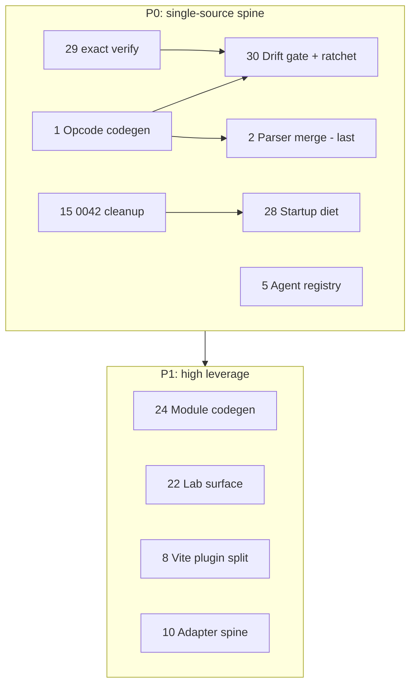

# LLP 0150: Elegant Simplification Through Contract Compression

**Type:** RFC
**Status:** Implemented
**Systems:** Kernel, Protocol, Runtime, Renderer, Agent API, Tooling, Devtools, Router, Facet, Platform Hosts, Build, Workspace, CI
**Author:** Charlie Cheever / Claude
**Date:** 2026-06-09
**Revised:** 2026-06-09 (unified with former LLP 0152 — parallel-implementation collapse merged in; LLP 0153's cross-doc coordination folded into the Coordination section here; the speculative LLP 0154 child plan removed, its protocol P0 absorbed here; then the P0 spine + ideas 22/31 implemented — see Implementation Record)
**Lanes:** t1-ios-caltrain, web-dev-engineering, agent-inspector-core
**Related:** LLP 0004, LLP 0006, LLP 0008, LLP 0010, LLP 0027, LLP 0042, LLP 0043, LLP 0097, LLP 0098, LLP 0109, LLP 0124, LLP 0127, LLP 0128, LLP 0140, LLP 0143, LLP 0149, LLP 0151, `llp/project-refinement-march-2026.rfc.md`, `platform-approaches.md`, `philosophy.md`

## Implementation Record (2026-06-09)

The Accepted Scope (the P0 spine, decision rules, ratchet, and metrics
infrastructure) plus the ship-anytime P1s (ideas 22 and 31) are implemented
on branch `@ccheever/extensive-simplification`, in the Coordination execution
order:

| Idea | What landed |
| --- | --- |
| 29 `exact verify` | `exact-verify.json` (49 checks, 8 profiles, lane tags) + `scripts/exact-verify.mjs` + `ex verify` CLI delegation + `verify-registry-consistency` (no-new-root-`check:*` gate); `react-native-parity.yml` expands the `rn-parity-current-claim` profile instead of 32 hand-listed steps |
| 1 Protocol inventory → codegen | `tests/protocol/protocol-inventory.json` (fixture-backed authority) → generated `opcodes.generated.ts`; the `0x50–0x54` module-opcode drift resolved by generation (TS gained the opcodes; `exact-modules` + `assets-fonts-registry` import instead of re-declaring); Swift/Kotlin parity-checked; encoder coverage checked; 7 binary conformance fixtures incl. a TS↔Rust byte-identity test |
| 30 Drift gate + ratchet | `protocol-parity-gate` (core + governance profiles) + `scripts/check-duplication-ratchet.mjs` with baselines in `exact-contracts.json` (decision rule 9 enforced in CI) |
| 5 Agent operation registry | 5-tool `agent-inspector-core` vertical slice (`operations/registry.ts`): HTTP dispatch + MCP defs derived, client method declared, `agent-registry-completeness` gate; MCP manifest byte-identical; edit-sites 3→1 |
| 15 0042 cleanup | `js/src/renderer/` bridge deleted; importers redirected to `@exact/renderer`; environment-safety + lane-import scans clean |
| 28 Startup diet | `startup-budget` ratchet check (boots dev server, measures `/__exact/startup-diagnostics`): Caltrain native graph budgeted at 173 modules / ~1.08 MiB; `docs/observability-minimum.md` written before any lazy-loading; both lazy seams verified existing |
| 2 Parser dispatch unification | sequenced last per the regret note — one shared dispatch core; three pinned divergences resolved deliberately (uniform op counting; strict trailing-byte error; strict unallocated-opcode rejection on the hot path); benchmarks within budget |
| 22 Lab surface | `@exact/lab-surface` package; 10 copied `native-exact.ts` shared cores → re-exports (ratchet 10→0); `docs/lab-surface.md` |
| 31 Repo hygiene | 282 tracked debris files removed (`dev-server/`, `older/`, `workouts/`, `tmp.facet-review.*`, `dummy`, `mydb.sqlite*`, `*.tmp`); `.gitignore` gaps closed; README truthful; spec banner (with 0151 idea 12) demotes stale status markers |

P1/P2/P3 backlog items not named above remain ranked candidates requiring
child plans or scoped implementation notes, per the Accepted Scope.

## Summary

Exact's center — kernel layout, binary protocol, multi-host rendering, agent
observability — is strong. Most day-to-day complexity is not in those ideas. It
is in **parallel truths**: the same contract maintained by hand in several
places, the same behavior implemented in several codepaths, the same lab scaffold
copied twelve times, the same startup graph loaded whether or not a feature is
used, the same verification logic spread across dozens of root scripts.

This RFC catalogs the cross-cutting simplification backlog under **one
principle**:

> **One authority per boundary, one implementation per behavior. Define each
> thing once, then generate, derive, or lazily load everything else.**

These are two faces of the same idea — `philosophy.md`'s "One Behavior, One
Implementation" applied to *contracts* (opcode tables, route registries,
capability bits) and to *implementations* (parser dispatch, the agent route
surface, per-platform module bindings). Drift is the enemy in both cases.

The goal is not minimal LOC. It is **conceptual surface-area reduction**: fewer
things a contributor must remember, fewer places an agent must touch to make one
coherent change, fewer accidental couplings between app / runtime / tooling /
server environments. The quantity that actually hurts is **edit-sites per
change** — how many files you touch to add one opcode, one agent tool, or one
module — so that, not lines-removed, is the headline metric.

**This RFC unifies what were two concurrent proposals** — the former 0150
(contract compression) and the former 0152 (collapsing parallel implementations).
They were the same principle from two angles and overlapped on every P0; merging
them removes the inter-document ownership negotiation that was itself a
parallel-truth surface. The former 0152 is now a redirect stub. Its distinct
content — the agent route registry, kernel parser/macro work, renderer god-file
splits, package consolidation, cross-platform module codegen, and the
single-source drift gate — lives here, in the idea catalog below.

It composes with **LLP 0151** (product lanes: *which* work is active). This RFC
also now carries the cross-doc coordination — the sanctioned sources of truth,
the ownership split, and the execution order — that a separate plan (the former
LLP 0153) used to hold. See
[Coordination with LLP 0151](#coordination-with-llp-0151).

## Coordination with LLP 0151

The June simplification work is **two** documents: this RFC (single-sourcing —
contracts *and* implementations) and **LLP 0151** (product lanes — *which* work is
active). They compose: contract compression reduces how much code a lane needs;
lane pruning reduces how many contracts must be load-bearing. (A former third RFC,
0152, merged into this one; a former coordination plan, 0153, folded its
sources-of-truth and sequencing into this section; there is no 0154 — the protocol
P0 is simply this RFC's P0, below.)

**Four sanctioned sources of truth**, each with one owner — nothing else may copy
their data:

| Concern | Source of truth | Owner |
| --- | --- | --- |
| Active lanes & lane policy | `exact-lanes.json` | 0151 |
| Checks, gates, ratchets | `exact verify` registry | this RFC (idea 29) |
| Contract authorities (incl. protocol identities) | `exact-contracts.json` + the fixture-backed protocol inventory | this RFC (idea 1) |
| Agent operations | one `AgentOperation` registry (`agent-inspector-core` is its first lane slice) | this RFC (idea 5); lane membership scoped by 0151 |

**Ownership split.** This RFC owns contract/implementation single-sourcing:
protocol codegen, parser unification, the agent operation registry, `exact
verify`, the drift gate + ratchet, the startup diet, the 0042 cleanup, and the
styling charter. 0151 owns lanes: `exact-lanes.json`, lane lifecycle, the
warning-first lane-debt ledger, and research/incubator quarantine — and it scopes
*which lanes* this RFC's single-sourcing applies to first (`release` and
`engineering-critical` before incubator/research).

**Execution order.** Lanes come first so the rest is scoped:

1. **Lane truth** (0151) — `exact-lanes.json` + lane report + warning-only debt
   ledger.
2. **Verification + contract inventory** (ideas 29, 30) — the `exact verify`
   registry shape and `exact-contracts.json`; the drift gate's round one co-ships
   with the codegen.
3. **Protocol P0** (ideas 1, 30, 2) — opcode/prop/style codegen, the parity gate,
   then parser dispatch unification *last* (gate-first merge; the parser is the
   one behavior-regressing item).
4. **Agent operation registry slice** (idea 5) — the 5-tool `agent-inspector-core`
   vertical slice before bulk migration.
5. **Low-regret cleanup & startup diet** (ideas 15, 28, 31, 22) — once the truth
   surfaces are usable.

**Coordination rules** (beyond the Decision Rules below): no second verification
registry — every check/gate/ratchet registers in `exact verify`; release-blocking
follows a pointer chain (LLP 0146 parity row → `exact-lanes.json`
`blocks`/`verifyProfileIds` → `exact verify` execution), no step copying the
prior's data; low-regret single-sourcing before high-regret parser/runtime
rewrites. Acceptance is independent — accept or reject this RFC and 0151
separately.

The [Prioritization](#prioritization) roadmap below sequences this RFC's own
ideas; the execution order above is the cross-doc sequence against 0151's lanes.

## Accepted Scope

Acceptance of this RFC means accepting:

1. the diagnosis that duplicated contracts, parallel implementations, and eager
   boundary crossings are the current highest-leverage simplification targets;
2. the **P0 spine** and its sequencing (low-regret single-sourcing first, the
   high-regret parser merge last — see Prioritization);
3. the decision rules below, enforced by the **duplication ratchet**;
4. the success metrics below (edit-sites first, LOC second); and
5. the requirement that P1/P2/P3 items get a small child plan, existing-LLP
   amendment, or scoped implementation note — naming owner, compatibility story,
   verification path, and rollback — before they become implementation
   commitments.

Acceptance does **not** approve every backlog item as fully designed, nor a
big-bang migration of all ~64 agent tools or all ~3,500 LOC of parsers. P0 is the
single-source spine plus the gate that makes it durable; everything else is
ranked candidate scope. **No separate protocol child plan is required** (there is
no 0154): before high-regret P0 work starts, the coordination first slice (see
[Coordination with LLP 0151](#coordination-with-llp-0151)) links this P0 to
0151's first lane manifest and picks the protocol authority source. Parser
unification and bulk agent migration still need scoped implementation notes with
owner, verification, benchmark, and rollback details (not a planning document of
their own).

## Diagnosis: where complexity actually lives

`philosophy.md:149` already states the principle: *"If a behavior exists, it
should be defined in exactly one place. Everything else should derive from that
definition."* The March 2026 refinement RFC made "One Behavior, One
Implementation" its headline. Three months later the **June re-measurement** is
uncomfortable: in the highest-traffic areas the duplication did not shrink — in
some it roughly doubled, and two new parallel implementations (the MCP transport
and the Windows + Android hosts) were added on top.

| March 2026 drift site | June 2026 state | Direction |
|---|---|---|
| Protocol parsing (3 parsers) | Still 3 files, **3,520 LOC**; shared `prop_decoder` + `style_decoder` landed, but **opcode dispatch still triplicated** | partial progress |
| Agent server (`server.ts` 4,109 LOC, "to be split") | `server.ts` = **8,785 LOC**, not split; **+ a 2,932-LOC MCP adapter** = a 3rd hand-maintained edit-site per tool | 2× worse + a 3rd edit-site |
| Opcode/propId defs (Rust ↔ TS/native) | still hand-mirrored; Rust module opcodes `0x50`–`0x54` **missing from TS** | unchanged + drift found |
| Native renderers (iOS + web) | **+ Windows host (~9.5K LOC) + Android host (~17K LOC)** — two new protocol consumers | multiplier grew |

Across the repo the opportunities cluster into five patterns:

| Pattern | Symptom | Example evidence |
| --- | --- | --- |
| **Parallel implementation** | Same semantics, multiple codepaths | 3 kernel parsers; agent ops across `server.ts`/`mcp-server.ts`/`client.ts` |
| **Parallel contract** | Same constants hand-mirrored | Rust/TS/Swift/docs opcodes with parity checks; module opcodes drifted |
| **Scaffold duplication** | N nearly identical apps | 12 `*-lab/main.tsx`; 11 `native-exact.ts`; 10 `routes.platform.ts` |
| **Boundary collapse** | One import pulls too much | `js/src/index.ts` barrel; native startup eager graph (~286 modules, ~4.6 MiB) |
| **Verification sprawl** | CI truth in many scripts | 36 root `check:*` scripts; hand-maintained route baselines |

**The cost model.** A change that should touch one file touches N:

- **Add/change an opcode or prop:** `opcodes.rs` → `parser.rs` + `streaming.rs` +
  `streaming_optimized.rs` → `opcodes.ts` + `encoder.ts`. ≈ **6 edit-sites, 2
  languages, 3 parsers.**
- **Add an agent tool:** an HTTP route/operation in `server.ts`, a tool case in
  `mcp-server.ts`, a wrapper in `client.ts`. ≈ **3 hand-maintained edit-sites**
  (the operation logic itself lives once, in `server.ts`).
- **Add a native module/control:** one `defineModule()` is the dream, but iOS
  control bindings are hand-written while Android is generated — parity is
  per-platform manual labor.
- **Add a platform:** re-implement the protocol consumer from scratch (four
  independent tree-walkers today).

Each multiplier is individually defensible; together they are why the codebase
feels heavier than its genuinely-excellent core deserves. **The drift-prone
duplication is the part that gets worse on its own, so it gets priority.**

**Encouragingly, Exact has already proven it can do this.** The `_design` system
unified every lab/demo theme into thin shims; `prop_decoder`/`style_decoder` are
shared across all three parsers; `capability_bits` and the builtin module
manifest are codegen'd from one Rust source into both Rust and TS
(`packages/exact-runtime/src/host/capability_bits.rs` →
`capability_bits.generated.rs` + `capability-bits.generated.ts`). Most of the ask
is to **finish and replicate patterns the project already shipped**, in the
places that matter most.

## Contract & implementation inventory

The operational form of "one authority per boundary." Child work may refine names
and paths but should not introduce a second untracked truth for the same
boundary.

| Boundary | Current parallel truths | Proposed authority | Derived outputs | CI guard |
| --- | --- | --- | --- | --- |
| Protocol ABI constants | Rust enums, TS constants, Swift enums, docs | Fixture-backed protocol inventory (manifest + `tests/protocol/fixtures/*.bin`) | TS constants, web encoder `name→PropId`, Swift/docs where practical | Generated-output diff + parity tests until replaced |
| Kernel decode semantics | `parser.rs`, `streaming.rs`, `streaming_optimized.rs` | One shared dispatch core in `kernel/src/protocol/` | Thin buffered/streaming/optimized wrappers | Conformance, malformed-frame, streaming, benchmark checks |
| Agent operations | `server.ts` routes, `mcp-server.ts` cases, `client.ts` wrappers | One `AgentOperation` registry | HTTP router, MCP manifest, typed client, OpenAPI/docs | Registry-completeness gate (HTTP+MCP+client per op) |
| Native module/control bindings | Hand-written iOS, generated Android | One `defineModule()` declaration | Per-platform bindings (iOS/Android/Windows) | Module-codegen coverage gate |
| Lab app surface | Lab `main.tsx`, `native-exact.ts`, store glue | Lab manifest + shared `@exact/lab-surface` | Per-lab bootstrap + native/web shims | Scaffold/generation diff in `exact verify` |
| Route contracts | Filesystem routes, `routes.platform.ts`, JSON baselines | Filesystem route tree + explicit metadata | Platform registries and baselines | Route-contract profile in `exact verify` |
| Verification | Root package scripts, CI YAML, one-off scripts | Structured `exact verify` registry | CLI profiles + CI job expansion | Registry schema + no-new-root-`check:*` rule |
| Native startup graph | Import graph across runtime/devtools/agent/router | LLP 0128 startup budget/ratchet | Lazy feature entrypoints | Module-count budget check |
| Styling ownership | `_design`, Facet, React primitives, app themes | Three-layer styling charter | Shared theme/demo exports | Duplicate-token check |

The machine-authoritative form of this table is `exact-contracts.json` (consumed
by the `exact verify` registry, idea 29); the prose table here is generated from
or mechanically checked against it. Generated files carry provenance: source
authority, generator command, LLP reference, and whether committed or build-only. **Generate contracts, registries,
and thin scaffolds; keep substantive app, host, and runtime behavior
hand-authored.**

## The ideas

Grouped into families. Each entry names what to simplify, why, evidence, and
tier. **P0 items carry acceptance tests; the rest are scored candidates.**
Mechanism tags — *generate / restructure / share / delete / govern / lazy-load* —
appear in the appendix, because naming the mechanism picks the right tool
(reaching for codegen where a delete or shared import is correct is how
simplification re-expands).

### Family A — Protocol & kernel (the single-source core)

**1. Generate opcode/prop/style tables from one protocol inventory.** *(P0)*
Opcodes live in `kernel/src/protocol/opcodes.rs` and are hand-mirrored in
`packages/exact-core/src/protocol/opcodes.ts`; the web encoder
(`packages/exact-renderer/src/protocol/encoder.ts`) hand-authors its own
`name → PropId` table (the drift surface is the *mapping*, not the numbers).
Real drift already exists: Rust allocates module opcodes `0x50`–`0x54`
(`ModuleRegister`…`ModuleEvent`) that the TS `OpCode` table lacks. Declare
numeric identity and payload shape **once** and generate/parity-check everywhere.
Recommended authority: a **fixture-backed inventory** (a small manifest plus
`tests/protocol/fixtures/*.bin`) — language-neutral, turns drift into a concrete
byte-sequence failure, and doubles as the parser suite that de-risks idea 2.
Rust-first extraction is an acceptable faster fallback. The mechanism is already
proven (capability bits, builtin manifest).
*Evidence:* `opcodes.rs`/`opcodes.ts` parity comments; LLP 0149 ABI discipline.
*Acceptance:* authority source named before coding; generated TS + encoder tables
reproducible from a clean checkout; CI fails when any allocated Rust opcode is
absent from generated TS or an explicit exemption; the **first deliverable
resolves the `0x50`–`0x54` case** (generate or formally exempt) to validate the
machinery on a real divergence; Swift/Kotlin/Windows/docs generated, parity-
checked, or exempted with owner + sunset; existing Rust parity tests stay until
replaced.

**2. Unify the three kernel parsers behind one dispatch core.** *(P0 — highest
regret; sequence last)* Collapse `parser.rs` (1,541), `streaming.rs` (706),
`streaming_optimized.rs` (1,273) = 3,520 LOC. The shared `prop_decoder`/
`style_decoder` already landed; what remains is **opcode-dispatch triplication**
(buffered match arms, streaming iterator arms, optimized function-pointer table).
Extract one dispatch table; let the three modes differ only in read mechanics.
This also subsumes the deferred unsafe-parser concern (March Decision 2).
*Regret note:* this is the one item that can regress *behavior*, not just
structure — `streaming_optimized.rs` diverged for the security-sensitive zero-copy
hot path. It carries the heaviest gate and should land **after** ideas 1/29/30
build confidence, never as the opening move.
*Acceptance:* existing parser tests pass; partial-frame streaming, malformed-input
recovery, and zero-copy hot paths preserved; optimized-path benchmarks within an
agreed budget; wrappers expose transport differences without duplicating semantic
decode rules.

**3. Variable-length `SetStyle`; retire the patch opcodes.** *(P2 — ABI change,
high risk)* `SetOpacity (0x20)`, `SetTransform (0x21)`, `SetBgColor (0x22)` exist
mainly to avoid shipping/rebuilding the 64-field `StyleProps` struct. The protocol
already carries a 64-bit style mask — use it to make `SetStyle` variable-length
(changed fields only), and the three patch opcodes plus the optimized parser's
"reusable StyleProps" hack become unnecessary. Requires explicit ABI versioning
and coordinated iOS/Android/Windows/web updates; do not start until idea 2 lands
and consumers read generated opcode tables.

**4. Macro-generate the repetitive kernel boilerplate.** *(P2/P3)* `style.rs`
(1,290 LOC) hand-writes ~18 enums with near-identical `TryFrom<u8>`/`From<taffy>`
impls; `ffi.rs` (4,031 LOC, 75 `#[no_mangle]` fns) has ~30 identical
"null-check → call → map Result to 0/-1" wrappers. A `protocol_enum!` and an
`export_kernel_op!` macro collapse ~300 LOC of boilerplate and the copy-paste
risk.

### Family B — Agent API & dev server (largest LOC mass; newest drift)

**5. One agent operation registry → derive HTTP + MCP + client.** *(P0)* The same
~64 operations are hand-maintained across **three edit-sites**: ~77 HTTP branches
in `server.ts` (8,785 LOC), 64 MCP cases in `mcp-server.ts` (2,932), ~64 wrappers
in `client.ts` (2,096). *Framing:* this is **not** three parallel implementations
— the logic lives once in `server.ts`; `client.ts` is a thin HTTP wrapper and
`mcp-server.ts` delegates to the client. The pain is "edit three hand-maintained
sites + keep three schemas in sync per tool." Define each operation once as an
`AgentOperation` contract (route, methods, request schema, response kind —
`json`/`binary`/`multipart`/`sse`/host-bridge-relay — auth/host-bridge policy,
transport exposure, aliases, defaulting, `observeAfter` support, fixture ids),
then derive the router, MCP manifest, typed client, and docs. The relay/direct
transports (LLP 0140) plug into the same registry. This also dissolves the
`server.ts` god-file the March RFC asked to split. *Durable win is edit-sites
3→1; LOC removal is smaller than it looks (marshaling relocates, not deletes).*
*Acceptance:* adding a tool edits one registry entry; CI proves matching HTTP
route + MCP entry + client method with identical schema and declared transport;
ship a **5-tool vertical slice first** (`exact_tree`, `exact_screenshot`,
`exact_snapshot`, `exact_tap`, + one host-bridge/debug endpoint covering
binary/multipart, a mutation with `observeAfter`, and direct-vs-relay) before
bulk migration; direct HTTP, Vite relay, MCP, and `ExactAgent` preserve response
semantics; reject big-bang cutover.

**6. Consolidate redundant agent tools.** *(P1)* Fold the gesture family
(`exact_tap`, `exact_touch_sequence`, `exact_mouse_sequence`, `exact_gesture`)
into one polymorphic op, and 6–7 `exact_debug_*` router tools into one
`exact_router_debug` with an action selector. Existing MCP names/HTTP endpoints
remain as **registry aliases** for at least one release phase. Falls out of
idea 5's registry.

**7. Right-size the agent surface: core + plugin namespace.** *(P1)* ~64 tools at
~360 LOC/tool (directory average) is large for Phase 0. Not a feature cut — define
a stable **core** set (tree/snapshot, screenshot, layout, accessibility,
diagnostics, logs, hit-test, tap/click, text input, scroll, guarded `run-js`) and
move router-internal/debug tools to an opt-in **plugin namespace** so the cost of
a tool is visible. The core list is the reconciled `agent-inspector-core` lane
minimum (LLP 0151); later additions need a lane update, not an ad hoc route.

**8. Split the 14k-line Vite plugin into bounded modules.** *(P1)* Decompose
`packages/exact-devtools/src/vite-plugin.ts` (~14,479 LOC) into native envelope,
HMR, CSS pipeline, agent relay, and target isolation. Complements LLP 0109
(which added target isolation but not internal structure); no external behavior
change.

**9. Untangle `exact-devtools`; fold the `dev-server/` wrapper.** *(P2)*
`exact-devtools` (~71.5K LOC) mixes agent protocol (~35.7K), build/Vite/CSS
tooling (~13.3K), and codegen. Split agent protocol from build scripts so agent
tooling doesn't drag in Vite, and fold the 263-byte `dev-server/` launcher into
it.

### Family C — Renderer & framework adapters

**10. Extract a shared framework-adapter spine.** *(P1)* The React/Solid/Vue/
Svelte adapters each re-implement root lifecycle, the handler registry, and
window-state subscription (~250 LOC duplicated). Factor the spine into
`adapter-shared.ts`; each adapter keeps only its framework glue.
**Framework-agnosticism stays a value — keep all four; just stop copy-pasting the
plumbing.** (Open question: whether Svelte's 1,736-LOC `dom-shim.ts` earns its
keep — a 0043 amendment, not this RFC.)

**11. Split the renderer god-files.** *(P2)* `host-ops.ts` (2,627 LOC — create /
prop+style update / commit / events / safe-area) and `inspector.ts` (3,477 LOC —
snapshot / a11y tree / refs / hit-test) split along existing seams; the
`exact-react` barrel (1,412 LOC) moves hooks/utilities to subpaths. Mechanical,
low-risk. (Canonical renderer code is `packages/exact-renderer/`; `js/src/renderer/`
is migration shims — see idea 15.)

**12. Extract `.shared.ts` from `.web`/`.native` pairs; merge the app-runtime
core.** *(P2)* ~100 platform-split files share types/data verbatim.
`app-runtime.tsx` (461) vs `app-runtime.native.tsx` (367) have ~100% identical
type blocks and ~250 LOC of identical config normalization. Extract the shared
mount/bootstrap core; keep only genuine platform deltas in `.native`. Establish
the `x.shared.ts` convention.

**13. Ship a cross-platform `<Link>` / nav primitive.** *(P2)* Native route
layouts hand-roll ~120 LOC of routing (`navItems`, `routeProfileForPath`,
`Pressable` nav) that web gets free from `<Link>`. A shared primitive deletes the
per-route duplication and shrinks the `.web`/`.native` gap (feeds idea 12).

**14. Capability-aware presenter snapshot pruning on Apple hosts.** *(P2)* The
host bridge sends trimmed snapshots to projection/secondary surfaces based on
declared presenter capabilities, instead of serializing fields presenters cannot
use. Direct recommendation from LLP 0116; simplifies host-bridge codepaths.

### Family D — Workspace & packaging

**15. Finish the post-0042 environment-boundary cleanup.** *(P0)* Remove the
historical `js/src/renderer/` bridge; ensure tests import `@exact/renderer`
directly; keep `js/src/index.ts` free of transitive tooling/server imports.
LLP 0042 is implemented, but legacy paths preserve the old graph shape and
confuse canonical ownership.
*Acceptance:* no production/test code imports the historical bridge outside a
time-boxed shim; browser, Hermes/native, and server/devtools import-graph checks
pass; the public barrel pulls no tooling/server-only deps into app/runtime
entrypoints.

**16. Delete the stub packages.** *(P1 — ship anytime)* `exact-list` is a 1-LOC
re-export of `@exact/list-react` — delete it and point consumers at `list-react`
after confirming no `@exact/list` importers. (`exact-camera` is **not** a stub —
it has `src/index.tsx` and an `ios/` dir; audit, don't assume-delete.)

**17. Consolidate single-capability native-module packages.** *(P2)* 13 capability
packages (~5.8K LOC, several < 300 LOC) each carry package.json/version/publish
overhead; `exact-expo-adapter` lists 9 as deps. Group into ~3–4 app-facing
packages (native-io, native-media, native-sensors, native-hardware). **Do not
start until the federated per-platform split direction is confirmed** — keep them
compatible with that end state.

**18. Native-module package template generator.** *(P2)* 15+ thin packages share
`@exact/codegen` + `@exact/modules` boilerplate. Generate new modules from a
template manifest (extends LLP 0004's builtin-registry win).

**19. Promote labs to first-class workspace packages.** *(P1)* Move `js/src/*-lab/`
to `packages/exact-lab-*` or `labs/*` members. One `js/tsconfig.json` covering
runtime + 12 labs + sibling sources is a structural typecheck problem (1,800+
error lines; 237 files under `js/src/*-lab/`). Distinct from 0042 (which split
packages but left labs in `js/`).

**20. Bring `examples/` into the workspace with a shared `@exact/demo-theme`.**
*(P3)* `examples/facet-gallery` and future demos should be workspace members
importing shared theme/helpers instead of copying lab files
(`examples/facet-gallery/src/facet-theme.ts` duplicates lab theme).

**21. `createExactViteConfig()` factory + `resolveExactWorkspace()` helper.**
*(P1)* Replace nine Vite config variants and the ~30-line manual alias wall in
`js/vite.config.ts` with one factory driven by package `exports` maps. Named
follow-up deferred in 0042 Phase 5.

### Family E — Labs, scaffolding & routes

**22. Lab Surface Factory + shared `@exact/lab-surface`.** *(P1 — implement once)*
Codify the shared lab contract (`main.tsx` bootstrap, optional `store.ts`, route
hookup, agent intents) as `ex lab scaffold` output, and extract the genuinely
shared renderer/router surface (the overlapping core of the 11 `native-exact.ts`
files, 37–60 LOC each) into one `@exact/lab-surface` import. **Division of labor:
the shared 90% is a real *import*; only thin per-lab glue is *generated*** — a
generator that emits copies of the shared surface re-creates the drift problem the
moment one copy is hand-edited. App-specific native helpers stay local. Pick one
pilot lab; decide whether the manifest targets the current `js/src/*-lab` shape,
the future workspace-package shape (idea 19), or both.

**23. Generate route registries + baselines; slim the generated route types.**
*(P1)* `routes.platform.ts` registries and JSON baselines should be build
artifacts derived from the filesystem route tree + explicit metadata, not
hand-maintained parallel lists. Separately, the 113 generated files (~9.8K LOC)
under `js/src/__generated/routes` churn repeatedly ("regenerate route headers",
"stabilize header paths") — investigate a slimmer, deterministic codegen output
(fewer files, stable paths) to cut footprint and churn noise.

### Family F — Cross-platform parity, styling & runtime governance

**24. Unify native-module/control codegen across iOS / Android / Windows.** *(P1)*
`defineModule()` → codegen is the intended single source, but iOS control bindings
(`FacetNativeControls.swift`, ~100+ LOC each) are hand-written while Android is
generated. Drive all platforms' bindings from the one TS declaration — the
highest-leverage *platform-parity* win: a new control becomes one declaration +
regen, not N hand-edits. **Phasing:** generate Android/Windows first (active
lanes); iOS hand-written migration is a follow-on, not a gate for the iOS+web demo
lane.

**25. Freeze NodeType growth; migrate controls to NativeView.** *(P2 — govern)*
Treat new `NodeType` values as protocol ABI events requiring explainer
justification; migrate Switch/Slider/Checkbox to the generic NativeView path
(LLP 0027/0149). Every NodeType multiplies kernel, encoder, Swift, Windows,
Android, docs, and test surface. Encode the gate as an `exact verify` check
(LLP 0149 is an Explainer; don't rely on prose being remembered).

**26. Styling ownership charter: three layers, no fourth copies.** *(P2 — govern)*
Formalize and enforce: `_design` = lab/demo tokens; `@exact/facet` = product
components; `@exact/react` = behavior primitives; apps import, they don't fork.
Theme duplication persists (`facet-theme.ts` copied between `facet-lab` and
`examples/facet-gallery`).

**27. Continue Hermes runtime globals extraction.** *(P2)* Finish moving remaining
inline `installGlobals()` bodies into focused translation units with preserved
init ordering (LLP 0006 second wave); `hermes_runtime.cc` remains hard to
navigate.

### Cross-cutting — startup, verification & the drift gate

**28. Lazy-load devtools, agent bootstrap, and non-initial routes on native
startup.** *(P0)* Native startup loads ~286 common modules (~4.6 MiB source)
before any lab-specific code runs. Make agent server, devtools, router-schema
helpers, desktop/window APIs, and non-entry route modules load only when
requested. This is the implementation priority list for **LLP 0128**, not a rival
proposal.
*Acceptance:* native common startup modules hit a ratcheted LLP 0128 budget; HTTP
agent/devtools code is not loaded until requested; the **always-on observability
minimum is documented before lazy loading lands**; logs/crash breadcrumbs needed
before agent startup remain available when devtools are enabled later.

**29. `exact verify` as the single verification registry.** *(P0)* One structured
registry owns the 36 root `check:*` scripts, with named profiles (`core`,
`native`, `caltrain`, `agent`, `platform-*`) and a CLI entry point for discovery
and execution. Realizes the operational half of LLP 0098.
*Acceptance:* `exact verify --list` shows owner, platform tags, expected runtime,
profile, and artifacts per check; CI profile expansion is deterministic; no new
root `check:*` outside the registry; the first migration covers ≥1 JS test, 1
script check, and 1 platform/lab fixture; the registry is structured data first,
shell-out second.

**30. The single-source drift gate + duplication ratchet (keystone).** *(P0)* The
reason March's consolidation didn't stick is that nothing *prevented* re-drift.
Two composing gates, both registered as `exact verify` rules (never standalone CI
scripts):
- **Parity gate** — fails when a definition exists in one place but not its
  generated counterpart (an opcode in Rust but not the TS table; a capability bit
  out of sync; a registry entry without an HTTP+MCP+client derivation). Round one
  ships **with** idea 1 (opcode/prop/header + capability parity) — *P0 is not
  complete until it lands*. Round two adds agent-registry and module-codegen
  coverage.
- **Duplication ratchet** (counter gate) — records the parallel-truth counters
  from Success Metrics and fails when any **increases** (a *new* parallel boundary
  appearing). A counter may only go down or stay flat; a temporary increase needs
  an owner, replacement, and expiration. It can baseline today's counts
  immediately.
*Acceptance:* CI fails on protocol-inventory ↔ generated-consumer divergence
(incl. generated `opcodes.ts`) and on capability-bit drift; the round-two gate
fails when a registry entry lacks declared HTTP+MCP+client derivation or an
explicit exemption; all gate rules live in `exact verify`, lane-tagged per
LLP 0151.

**31. Repo hygiene & truthfulness pass.** *(P1 — ship anytime)* Remove the legacy
`dev-server/` launcher, `tmp.facet-review.*` sandboxes, stale compiled `.js`
beside `.ts`, root cruft (`dummy`, `*.tmp`, `mydb.sqlite*`, swap files, stale
`older/`/`workouts/` dirs), `.gitignore` gaps, and stale `[IMPLEMENTED]`/
`[PLANNED]` markers on `EXACT_UNIFIED_SPEC.md`. Cheap, and it makes every other
claim in the repo more trustworthy.

## Deliberately NOT simplifying (judgment)

These look like duplication but are intentional; collapsing them trades real value
for line-count:

- **Per-platform renderers (iOS/Android/Windows/web) sharing a snapshot
  consumer.** The divergence is the *point* — native idioms, accessibility, and
  scroll physics come from *not* sharing a renderer. At most extract the
  platform-agnostic hit-test/tree-diff *semantics*, never the rendering. **Defer.**
- **`web-primitives.ts` (1,650 LOC) vs native primitives.** The web path *is* a
  real website; its DOM/ARIA logic is web-only by design. **Keep.**
- **Text-selection semantics per platform.** macOS drag, iOS touch-side, Windows
  IME differ because the platforms differ. **Keep.**
- **Solid/Vue/Svelte adapters.** Framework-agnosticism is a stated value; idea 10
  shares the *spine*, not the adapters. **Keep all frameworks.**
- **Web DOM layout vs native kernel layout.** A deliberate product decision
  (`platform-approaches.md`); simplify shared *contracts*, not rendering
  philosophy. **Keep.**

## What this RFC does not propose

| Not proposing | Why | See instead |
| --- | --- | --- |
| Unifying web and native renderers | Breaks web-as-real-site principle | `platform-approaches.md` |
| Removing Solid/Vue/Svelte adapters | Framework-agnostic architecture is a feature | LLP 0043 |
| Moving list virtualization into kernel | Wrong ownership boundary | LLP 0143 |
| Replacing the HTTP agent API with binary EXRQ | Interface stability wins | LLP 0140 |
| Rewriting the router | Router needs investment, not deletion | LLP 0010 |
| Dropping Windows/Android/Linux plans | Platform scope is phase-gated, not removed | LLP 0119, 0147 |
| A full protocol/agent IDL (Rust+TS+Swift+Kotlin) | Large bet; start with the proven incremental codegen | ideas 1, 24 |

## Prioritization

| Idea | Family | Effort | Risk | Tier |
| --- | --- | --- | --- | --- |
| 1 Opcode/prop/style inventory → generated consumers | Protocol | M–L | M | **P0** |
| 30 Single-source drift gate + ratchet | Cross | M | Low | **P0** |
| 29 `exact verify` registry | Cross | M | Low | **P0** |
| 5 Agent operation registry | Agent | M–L | M | **P0** |
| 15 Finish 0042 boundary cleanup | Workspace | S–M | Low | **P0** |
| 28 Native startup graph diet (0128) | Cross | M | Low–M | **P0** |
| 2 Parser dispatch unification *(start last)* | Kernel | M | M | **P0** |
| 24 Unified module codegen (iOS/Android/Win) | Platform | M–L | M | P1 |
| 22 Lab Surface Factory + `@exact/lab-surface` | Labs | M | Low | P1 |
| 23 Generated route registries + slim types | Labs | M | Low | P1 |
| 21 Vite config factory | Build | M | Low | P1 |
| 8 Vite plugin split | Devtools | M | Low | P1 |
| 6 Consolidate agent tools | Agent | M | Med | P1 |
| 7 Right-size agent surface | Agent | M | Med | P1 |
| 10 Framework-adapter spine | Renderer | M | Low | P1 |
| 16 Delete stub packages | Workspace | S | Low | P1 |
| 19 Labs as workspace packages | Workspace | M | Med | P1 |
| 31 Repo hygiene | Cross | S | Low | P1 |
| 3 Variable-length SetStyle | Protocol | M | **High** | P2 |
| 4 Macro-generate kernel boilerplate | Kernel | S–M | Low | P2 |
| 9 Untangle devtools + fold dev-server | Workspace | M | Med | P2 |
| 11 Split renderer god-files | Renderer | M | Low | P2 |
| 12 `.shared.ts` pairs + app-runtime merge | Renderer | M | Low | P2 |
| 13 Cross-platform `<Link>` | Renderer | M | Low | P2 |
| 14 Snapshot pruning | Host | M | Low | P2 |
| 17 Consolidate module packages | Workspace | M | Med | P2 |
| 18 Native module template | Workspace | M | Low | P2 |
| 25 NodeType freeze + NativeView | Platform | M | Med | P2 |
| 26 Styling ownership charter | Design | M | Low | P2 |
| 27 Hermes globals extraction | Runtime | M | Low | P2 |
| 20 Examples in workspace | Workspace | S | Low | P3 |

**Sequencing.** Lead with the low-regret single-sourcing (ideas 1, 30, 29, 5, 15)
and the startup diet (28); **the gate (30) co-ships with the codegen (1) — P0 is
not done without it.** Sequence the parser merge (2) **last** among the P0s, after
the others build confidence. Ship the zero-risk wins (16, 31) anytime. P1 falls
out of the P0 registries; P2/P3 are opportunistic. The high-risk ABI change (3)
waits behind 2.

## Decision rules (to avoid re-expanding complexity)

1. **One authority per boundary, one implementation per behavior.** If two files
   must stay identical, one is generated from the other within a week, or the
   duplicate carries an owner, replacement, and expiration date.
2. **Generate contracts, not product behavior.** Generation is for ABI constants,
   registries, manifests, parity tables, and thin scaffolds. App, host, and
   runtime behavior stays readable and hand-authored.
3. **Lazy by default on native startup.** Eager imports require a written budget
   exception (LLP 0128). Lazy loading preserves a documented always-on
   observability minimum.
4. **No new root `check:*` script.** Add a named check to `exact verify` with
   owner, platform, runtime, artifact, and profile metadata.
5. **No new NodeType without the LLP 0149 checklist.** Prefer NativeView +
   `defineNativeView()`; encode the gate as an `exact verify` check.
6. **No fourth styling layer.** Apps consume `_design` / facet / react; they do
   not fork tokens.
7. **Preserve deliberate platform forks.** Web DOM and native kernel layout stay
   separate; simplify shared contracts, not rendering philosophy.
8. **Compatibility bridges expire.** Legacy import paths and duplicate scaffolds
   carry a replacement path and sunset date while kept during migration.
9. **The duplication ratchet only moves down.** A parallel-truth counter that
   increases fails CI unless the increase carries an owner, replacement, and
   expiration per rules 1 and 8.

## Success metrics

| Metric | Current signal | Target |
| --- | --- | --- |
| **Edit-sites to add one opcode/prop** | ~6 (`opcodes.rs` + 3 parsers + `opcodes.ts` + `encoder.ts`) | **1 inventory entry** (semantic handlers stay hand-authored) |
| **Edit-sites to add one agent tool** | 3 (HTTP + MCP + client) | **1 registry entry** |
| **Edit-sites to add one module/control** | N hand-edits, divergent per platform | **1 `defineModule()` + regen** |
| Kernel protocol parsers | 3 independent implementations | 1 core + thin wrappers |
| TS/Rust opcode drift | hand-mirrored + parity tests | 0 (CI codegen check) |
| Root verification scripts | 36 `check:*` | 1 `exact verify` registry + profiles |
| Native common startup modules | ~286 / ~4.6 MiB (0128) | ≤140 / ≤2.3 MiB before HBC |
| Copied native lab imports | 11 overlapping `native-exact.ts` | 0 copied shared exports; local helpers remain |
| Public barrel transitive imports | known tooling leaks post-0042 | 0 browser/Hermes env violations in CI |
| Source files > 1,500 LOC | several (`server.ts`, `vite-plugin.ts`, parsers, `inspector.ts`) | trending down; alert on regression |

**Prefer edit-site counts over LOC as the headline** — much of the "duplication"
is per-tool schema/marshaling that has to live somewhere, so LOC-removed is partly
a vanity metric. Measure the `git`-touched-file count for a representative change,
before/after. Several rows are **unlocked by this work rather than measurable
today** (opcode drift = 0 via idea 1, barrel violations via idea 15, the ratchet
via idea 30): read them as targets-with-infrastructure — the first deliverable for
each is the check that makes the number observable.

## Open questions

1. **Protocol authority source:** fixture-backed inventory (recommended),
   Rust-first extraction, neutral manifest, or spec-derived? *Leaning
   fixture-backed:* a small manifest plus `tests/protocol/fixtures/*.bin` is
   language-neutral, turns drift into a byte-sequence failure, and doubles as the
   parser suite that de-risks idea 2. Fixtures are the conformance proof, not the
   complete authority by themselves.
2. **Always-on observability minimum:** what diagnostics, log buffers, and crash
   breadcrumbs must exist before devtools/agent code is lazy-loaded (idea 28)?
3. **Agent registry richness:** does the `AgentOperation` schema model enough
   (binary/multipart/sse, host-bridge relay, `observeAfter`) to avoid pushing the
   parallel behavior into side tables?
4. **Lab factory vs. lab packages ordering:** generate scaffolds in the current
   `js/src/*-lab` shape first, or move labs to packages (idea 19) first?
5. **Federated modules vs. consolidation (idea 17):** confirm the eventual
   per-platform package split before consolidating, so it doesn't paint us into a
   corner.
6. **Svelte `dom-shim.ts` (1,736 LOC):** does one framework via a 1,700-LOC DOM
   emulation earn its keep? Gate on usage; revisit in a 0043 amendment.

## Standard review prompt

What do you think of this proposal? Is it a good idea? Do we have a good plan
here? How would you change it to make it better? What would you add or take away
or change? Is anything definitely or possibly wrongheaded here? Do you have any
novel ideas that you think might make this way better even if they are a bit
non-standard? What are the key open questions we need to answer to refine this?

## Appendix: idea index and former-id mapping

This RFC unifies the former 0150 (`#N`) and 0152 (`SN`) catalogs. Child plans
should reference the unified ids below.

| # | Idea | Tier | Mechanism | Former id |
| ---: | --- | --- | --- | --- |
| 1 | Opcode/prop/style inventory → codegen | P0 | generate | 0150 #2 ≡ 0152 S2 |
| 2 | Parser dispatch unification | P0 | restructure | 0150 #1 ≡ 0152 S1 |
| 3 | Variable-length SetStyle | P2 | restructure | 0152 S3 |
| 4 | Macro-generate kernel boilerplate | P2 | generate | 0152 S4 + S5 |
| 5 | Agent operation registry | P0 | restructure | 0150 #11 ≡ 0152 S6 |
| 6 | Consolidate agent tools | P1 | restructure | 0152 S7 |
| 7 | Right-size agent surface | P1 | govern | 0152 S8 |
| 8 | Vite plugin split | P1 | restructure | 0150 #10 |
| 9 | Untangle devtools + dev-server | P2 | restructure | 0152 S15 |
| 10 | Framework-adapter spine | P1 | share | 0152 S9 |
| 11 | Split renderer god-files | P2 | restructure | 0152 S10 |
| 12 | `.shared.ts` pairs + app-runtime merge | P2 | share | 0152 S11 + 0150 #15 |
| 13 | Cross-platform `<Link>` | P2 | share | 0152 S12 |
| 14 | Snapshot pruning | P2 | restructure | 0150 #16 |
| 15 | Finish 0042 cleanup | P0 | delete | 0150 #3 |
| 16 | Delete stub packages | P1 | delete | 0152 S13 |
| 17 | Consolidate module packages | P2 | restructure | 0152 S14 |
| 18 | Native module template | P2 | generate | 0150 #17 |
| 19 | Labs as workspace packages | P1 | restructure | 0150 #12 |
| 20 | Examples in workspace | P3 | share | 0150 #20 |
| 21 | Vite config factory | P1 | generate | 0150 #9 |
| 22 | Lab Surface Factory + `@exact/lab-surface` | P1 | generate + share | 0150 #6 + #7 ≡ 0152 S17 |
| 23 | Route registries + slim types | P1 | generate | 0150 #8 + 0152 S18 |
| 24 | Unified module/control codegen | P1 | generate | 0152 S16 |
| 25 | NodeType freeze + NativeView | P2 | govern | 0150 #13 |
| 26 | Styling ownership charter | P2 | govern | 0150 #14 |
| 27 | Hermes globals extraction | P2 | restructure | 0150 #18 |
| 28 | Native startup graph diet | P0 | lazy-load | 0150 #4 |
| 29 | `exact verify` registry | P0 | restructure | 0150 #5 |
| 30 | Single-source drift gate + ratchet | P0 | govern | 0152 S20 + 0150 ratchet |
| 31 | Repo hygiene pass | P1 | delete | 0150 #19 ≡ 0152 S19 |
